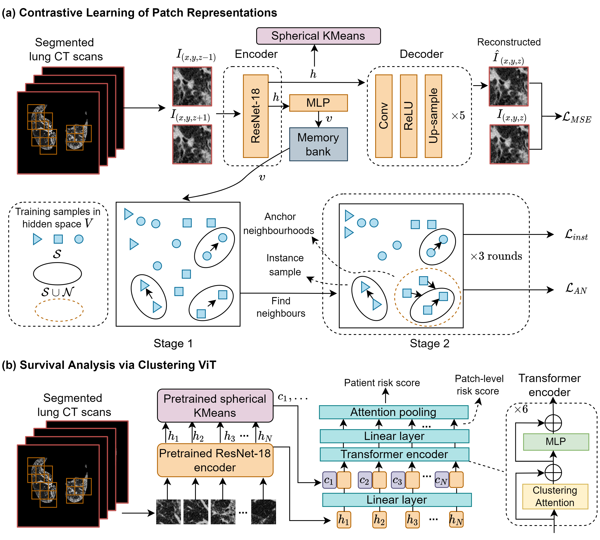

# Prognostic Imaging Biomarker Discovery in Survival Analysis for Idiopathic Pulmonary Fibrosis

Pytorch implementation of MICCAI 2022 paper.

Imaging biomarkers derived from medical images play an
important role in diagnosis, prognosis, and therapy response assessment.
Developing prognostic imaging biomarkers which can achieve reliable
survival prediction is essential for prognostication across various diseases
and imaging modalities. In this work, we propose a method for discov-
ering patch-level imaging patterns which we then use to predict mor-
tality risk and identify prognostic biomarkers. Specifically, a contrastive
learning model is first trained on patches to learn patch representations,
followed by a clustering method to group similar underlying imaging
patterns. The entire medical image can be thus represented by a long
sequence of patch representations and their cluster assignments. Then a
memory-efficient clustering Vision Transformer is proposed to aggregate
all the patches to predict mortality risk of patients and identify high-
risk patterns. To demonstrate the effectiveness and generalizability of
our model, we test the survival prediction performance of our method on
two sets of patients with idiopathic pulmonary fibrosis (IPF), a chronic,
progressive, and life-threatening interstitial pneumonia of unknown eti-
ology. Moreover, by comparing the high-risk imaging patterns extracted
by our model with existing imaging patterns utilised in clinical practice,
we can identify a novel biomarker that may help clinicians improve risk
stratification of IPF patients.



## Requirements
* python = 3.8.10
* pytorch = 1.7.1
* torchvision = 0.8.2
* CUDA 11.2

## Setup

# representation learning
For representation learning, the data is organized in webdataset format, which make it easier to write I/O pipelines for large datasets. Within the .tar file, a series of training samples are stored as .npy files. The sample follows the format

```
samples.tar
|
├── 0.npy                  # Random location (x1,y1,z) within slides
|   ├── image            # (64x64x2) Crops of CT scans at the location (x1,y1,z-1) and (x1,y1,z+1)
|   ├── image_he:        # (64x64x1) Crop of CT scans at the location (x1,y1,z)    
|   ├── image_pairs:     # (64x64x2) Crops of CT scans at the location (x2,y2,z-1) and (x2,y2,z+1)overlapping with "image" crops
|   ├── image_pairs_he:  # (64x64x1) Crop of CT scans at the location (x2,y2,z) 
|   └── idx_overall:     # (int) Used intervally when developping the alogithm
|
├── 1.npy                  # Another location
|   └── ...
|
└── 2.npy                  # Another location
|   └── ...
...

```
First, you can go into the folder /DnR run the training for representation learning using the command.

```bash
python run_dnr.py --phase train.
```

After getting the trained model, you can get patch representations for all the patch by using the command.

```bash
python run_dnr.py --phase test --trained_model './trainedModels/model_3_24.pth/'.
```
# clustering
Then using SphericalKMeans in spherecluster package to cluster all the patch embeddings.

# Mortality prediction bia clustering ViT
Finally, the patch embeddings and their cluster assignments are fed into the clustering ViT to predict mortality risk. For clustering ViT, the data follows the format

```
CTscans.npy
|
├── patientEmbedding   # (n x d) Embeddings for all patches within the CT scans generated from DnR, n is the number of patches, and d is dimention of embedding.
├── position # (n x 3) Cordinates for all patches in original CT scans
├── cluster # (n x 1) Cluster assignments for all patches generated from KMeans
├── Dead # 1 means the event is observed, 0 means censored
├── FollowUpTime # The time between CT scans date and the date of event or date of censored.
```

You can go into the folder install the library by running the command.

```bash
python setup.py install
```

Move .so files to models/extensions, and then train the model by running the command.

```bash
python main.py
    --lr_drop 100
    --epochs 100
    --group_Q
    --batch_size 4
    --dropout 0.1
    --sequence_len 15000
    --weight_decay 0.0001
    --seq_pool
    --dataDir /dataset
    --lr 2e-5
    --mixUp
    --SAM
    --withEmbeddingPreNorm
    --max_num_cluster 64
```
## Acknolegdement
The project are borrowed heavily from DETR, and End-to-end object detection with adaptive clustering transformer.
